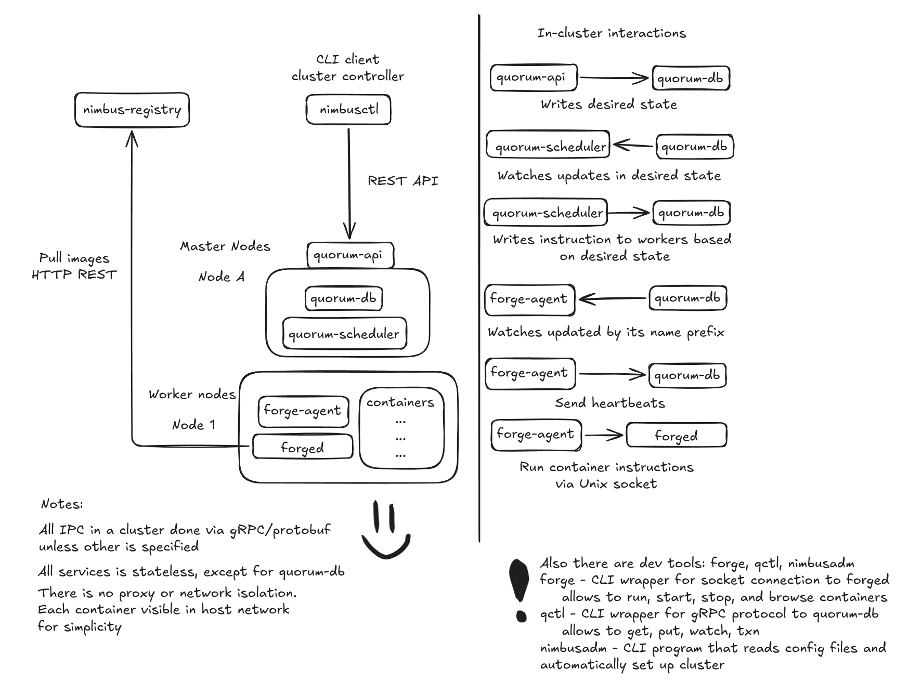

# Nimbus

[](LICENSE)

Nimbus is a distributed container orchestrator built from scratch. It consists of **Quorum** — a Go control plane with a from-scratch Raft consensus implementation, and **Forge** — a Rust container runtime with direct Linux namespaces and cgroups.

Does not aim to replace Kubernetes — it is a deliberately trimmed but honestly built system where every line of code is written and understood by the author.

## Architecture

See `docs/` for more detailed explanation of services and architecture
6

## Quick start

### Requirements

- Go 1.24+
- Rust
- Linux (namespaces/cgroups require Linux kernel)
- Docker (for test image builder)

### Build

```bash
git clone https://github.com/koftamainee/nimbus.git
cd nimbus

# Build test image
./scripts/build_test_image.sh

# Build all binaries
./scripts/build-all.sh
```

### Run

```bash
# Start a 3-master, 3-worker test cluster
sudo ./build/nimbusadm -f nimbus.yaml
```

In another terminal:

```bash
# Load test image into registry
curl -X PUT --data-binary @forge-test-python.tar http://127.0.0.1:11111/images/forge-test-python

# Deploy 2 replicas
./build/nimbusctl --addr http://127.0.0.1:10102 run test-srv --image forge-test-python --replicas 2

# List containers
./build/nimbusctl --addr http://127.0.0.1:10102 ps

# Scale down
./build/nimbusctl --addr http://127.0.0.1:10102 scale test-srv 1
```

## License

Apache 2.0 — see [LICENSE](LICENSE).
